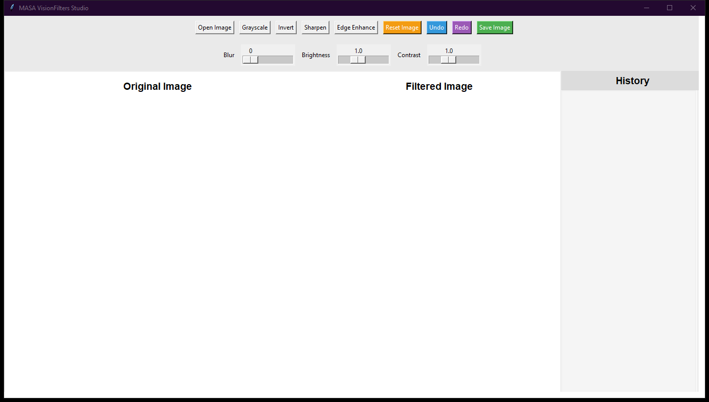

# MASA VisionFilters Studio

Real-time computer vision and image processing laboratory with algorithmic visual filters

## Technical Architecture

The application is architected with modular separation of concerns adhering to modern clean code standards:

- **Component Layering**: Isolated view layouts, state managers, and service controllers.
- **Defensive Engineering**: Robust input sanitization and exception management.
- **Modern Design Standards**: High-contrast dark-mode interface styled for optimal usability and visual polish.

## Preview



## Features

- Algorithmic filters: Gaussian Blur, Edge Detection, Grayscale, Sepia, and Sharpen.
- Side-by-side interactive before-and-after canvas rendering.
- Non-destructive filter pipeline with instant reset to raw source buffer.
- High-resolution image export supporting multiple bit depths.

## Prerequisites

- Python 3.10 or higher
- Required packages:

```bash
pip install customtkinter pillow requests
```

## Execution

Launch the application via Python:

```bash
python "Image Filtering App Using Tkinter in Python/main.py"
```

## Project Structure

```
.
├── Image Filtering App Using Tkinter in Python
├── screenshots/
│   └── app_interface.png
├── .gitignore
├── LICENSE             # MIT License
└── README.md           # Developer documentation
```

## License

This project is licensed under the terms of the MIT License. Refer to the `LICENSE` file for details.

---

### 🌐 Connect with Me

<p align="left">
  <a href="http://xrefs0.com/" target="_blank">
    
  </a>
  <a href="https://www.facebook.com/XREFS0" target="_blank">
    
  </a>
  <a href="https://t.me/MrMasaOfficial" target="_blank">
    
  </a>
  <a href="https://t.me/XREFS0_CHANNEL" target="_blank">
    
  </a>
  <a href="https://www.youtube.com/@XREFS0" target="_blank">
    
  </a>
</p>

